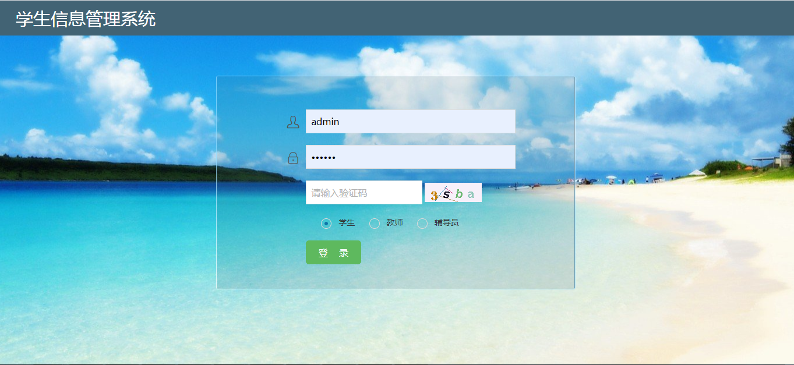
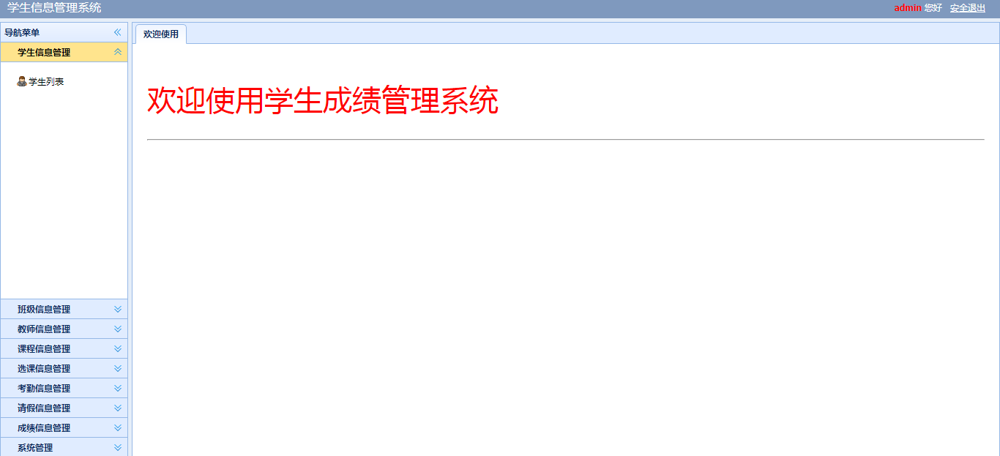
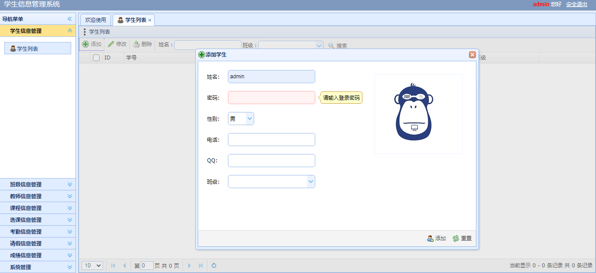
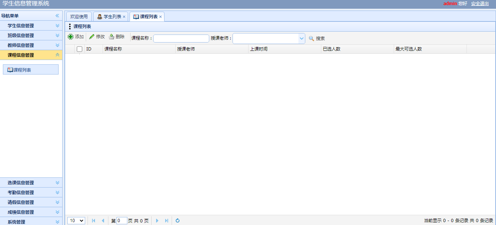

<h1 align="center">学生信息管理系统</h1>

## 简介
学生信息管理系统：角色分为管理员、学生和教师；提供学生信息管理、课程信息管理、教师信息管理、选课信息管理等功能。界面简洁美观，易于使用。    --计算机毕业设计源码；毕设源码；java毕业设计源码

## 联系方式

<h3 align="center">获取完整代码与数据库文件 + 微信：bysj5151 QQ: 86050149 QQ群: 783742310</h3>

<h3 align="center">可帮忙远程部署 包运行成功！提供远程部署、修改代码、设计文档指导、代码讲解等服务！</h3>

## 功能介绍（完整见运行截图）
管理员： 管理员可以通过导航菜单访问学生信息管理、班级信息管理、教师信息管理、课程信息管理等模块，进行课程信息的添加、修改、删除及搜索，并维护学生列表等数据。管理员界面还提供安全退出选项，确保账户安全。 用户： 用户在此系统中可以通过登录界面输入用户名、密码和验证码进行身份验证，然后选择相应身份（学生、教师、辅导员）登录，进入系统以访问相关的管理功能。系统界面设计友好，便于用户管理和操作信息数据。

## 运行截图

本代码来源于网络,仅供学习参考使用!

